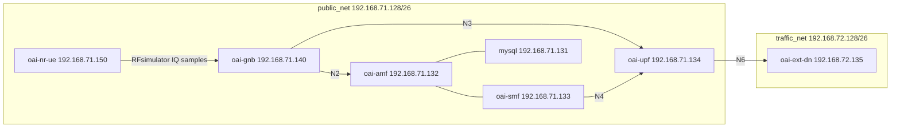

<!-- SPDX-License-Identifier: CC-BY-4.0 -->

# End-to-end FRMCS bands n100 and n101 with the RFsimulator in Docker

This tutorial runs a complete 5G SA system (OAI 5GC, OAI gNB, OAI nrUE) in
Docker containers on the FRMCS (Future Railway Mobile Communication System)
bands n100 and n101, using the RFsimulator instead of radios. It covers
building the images, deploying each scenario, checking attach and user-plane
traffic, and collecting the logs. The full gNB and UE logs of a reference run
are included in [Reference logs](#7-reference-logs).

**Table of Contents**

1. [Bands and scenarios](#1-bands-and-scenarios)
2. [Prerequisites](#2-prerequisites)
3. [Build the images](#3-build-the-images)
4. [Deploy a scenario](#4-deploy-a-scenario)
5. [Check the end-to-end connection](#5-check-the-end-to-end-connection)
6. [Collect the logs and stop](#6-collect-the-logs-and-stop)
7. [Reference logs](#7-reference-logs)
8. [Reference results](#8-reference-results)
9. [Limitations](#9-limitations)

## 1. Bands and scenarios

| Band | Duplex | UL (MHz)       | DL (MHz)       | NR-ARFCN (DL)   | GSCN                                   |
|------|--------|----------------|----------------|-----------------|----------------------------------------|
| n100 | FDD    | 874.4 - 880    | 919.4 - 925    | 183880 - 185000 | 2303 - 2307 (15 kHz)                   |
| n101 | TDD    | 1900 - 1910    | 1900 - 1910    | 380000 - 382000 | 4754 - 4768 (15 kHz), 4760 - 4764 (30 kHz) |

Three scenarios are provided. Each one has a gNB configuration file in
`ci-scripts/conf_files/` and a docker-compose file in `ci-scripts/yaml_files/`.

| Scenario                        | Bandwidth, SCS  | PointA (DL)           | Carrier center | SSB                           | CORESET0 | UE finds the SSB    |
|---------------------------------|-----------------|-----------------------|----------------|-------------------------------|----------|---------------------|
| `5g_rfsimulator_n100`           | 5 MHz, 15 kHz   | 183950 (919.75 MHz)   | 922.0 MHz      | 184370, 921.85 MHz, GSCN 2305 | index 0  | given (`--ssb 20`)  |
| `5g_rfsimulator_n101_u0_25prb`  | 5 MHz, 15 kHz   | 380090 (1900.45 MHz)  | 1902.7 MHz     | 380450, 1902.25 MHz, GSCN 4756 | index 0 | scan (`--ue-scan-carrier`) |
| `5g_rfsimulator_n101_u1_24prb`  | 10 MHz, 30 kHz  | 380136 (1900.68 MHz)  | 1905.0 MHz     | 380910, 1904.55 MHz, GSCN 4761 | index 0 | scan (`--ue-scan-carrier`) |

- n100 uses a 45 MHz duplex spacing: the UL carrier is at 877.0 MHz (PointA
  174950, 874.75 MHz).
- n101 uses a 5 ms TDD pattern.
- In all scenarios, the whole channel bandwidth, including the guard bands,
  lies inside the band. The gNB checks this at startup and prints an error
  (RBs outside the band) or a warning (guard bands outside the band)
  otherwise.
- All scenarios use the AWGN channel model of the RFsimulator (see the
  `channelmod` sections of the gNB configuration and of
  `ci-scripts/conf_files/nrue.uicc.conf`), so HARQ retransmissions occur.

The gNB configurations for the B205mini radio are in
`targets/PROJECTS/GENERIC-NR-5GC/CONF/gnb.sa.band100.25prb.usrpb205mini.conf`,
`gnb.sa.band101.25prb.usrpb205mini.conf` and
`gnb.sa.band101.24prb.usrpb205mini.conf`. The RFsimulator configurations only
differ in the gNB name, PLMN, IP addresses and the `channelmod` section.



## 2. Prerequisites

- Linux host with Docker and the Docker Compose v2 plugin (`docker compose`).
- About 20 GB of free disk space for the build images, 8 CPU cores
  recommended.
- The sources of the branch with the n100/n101 changes:

```bash
git clone https://github.com/rohanrkharade/openairinterface5g.git
cd openairinterface5g
git checkout feature/n100-n101-support
```

The core network images are pulled from Docker Hub:

```bash
docker pull mysql:9.6
docker pull oaisoftwarealliance/oai-amf:v2.2.1
docker pull oaisoftwarealliance/oai-smf:v2.2.1
docker pull oaisoftwarealliance/oai-upf:v2.2.1
docker pull oaisoftwarealliance/trf-gen-cn5g:latest
```

## 3. Build the images

The gNB and UE images on Docker Hub do not contain the changes of this branch,
so build them from the sources, as described in [How to build
images](../docker/README.md). From the repository root:

```bash
docker build --target ran-base --tag ran-base:latest --file docker/Dockerfile.base.ubuntu .
docker build --target ran-build --tag ran-build:latest --file docker/Dockerfile.build.ubuntu .
docker build --target oai-gnb --tag oai-gnb:latest --file docker/Dockerfile.gNB.ubuntu .
docker build --target oai-nr-ue --tag oai-nr-ue:latest --file docker/Dockerfile.nrUE.ubuntu .
```

> **Note:** The build Dockerfiles use BuildKit cache mounts. Without the
> `buildx` component, remove the `--mount=type=cache,...` lines from
> `Dockerfile.build.ubuntu` and `Dockerfile.gNB.ubuntu`/`Dockerfile.nrUE.ubuntu`
> and build with `DOCKER_BUILDKIT=0` and `--build-arg TARGETARCH=amd64`.

> **Note:** The `ran-base` build downloads the USRP FPGA images from
> `files.ettus.com`. They are not needed for the RFsimulator. If the download
> stalls, stopping the `uhd_images_downloader.py` process in the build
> container lets the build continue.

The docker-compose files use the images
`${REGISTRY}${GNB_IMG}:${TAG}` and `${REGISTRY}${NRUE_IMG}:${TAG}`. To use the
local images:

```bash
export REGISTRY= GNB_IMG=oai-gnb NRUE_IMG=oai-nr-ue TAG=latest
```

## 4. Deploy a scenario

The commands below use `5g_rfsimulator_n100`. For n101, replace the directory
with `5g_rfsimulator_n101_u0_25prb` or `5g_rfsimulator_n101_u1_24prb`. Only one
scenario can run at a time, they use the same container names and addresses.

Start the core network and wait until it is healthy:

```bash
cd ci-scripts/yaml_files/5g_rfsimulator_n100
docker compose up -d --wait mysql oai-amf oai-smf oai-upf oai-ext-dn
```

Start the gNB and the UE:

```bash
docker compose up -d oai-gnb oai-nr-ue
docker compose ps -a
```

The UE options are set in `USE_ADDITIONAL_OPTIONS` of the docker-compose file:

| Scenario               | UE options                                                                        |
|------------------------|-----------------------------------------------------------------------------------|
| n100                   | `-r 25 --numerology 0 --band 100 -C 922000000 --CO -45000000 --ssb 20`            |
| n101, 5 MHz, 15 kHz    | `-r 25 --numerology 0 --band 101 -C 1902700000 --ue-scan-carrier`                 |
| n101, 10 MHz, 30 kHz   | `-r 24 --numerology 1 --band 101 -C 1905000000 --ue-scan-carrier`                 |

- `-C` is the DL carrier center frequency, `--CO` the UL offset (FDD only).
- `--ssb` is the offset of the first SSB subcarrier from PointA, in subcarriers.
- `--ue-scan-carrier` makes the UE search all GSCNs of the band that fit in the
  carrier instead of using `--ssb`.

## 5. Check the end-to-end connection

### 5.1 gNB

The gNB prints the SSB frequency and, for n100, the DL and UL frequencies:

```bash
docker logs rfsim5g-oai-gnb 2>&1 | grep -E "absoluteFrequencySSB [0-9]+ corresponds|uldl offset|RRC_CONNECTED|PDU Session Setup"
```

```
[RRC]    I absoluteFrequencySSB 184370 corresponds to 921850000 Hz
[PHY]    I DL frequency 922000000 Hz, UL frequency 877000000 Hz: uldl offset -45000000 Hz
[NR_RRC] A [UL] (cellID bc614f, UE ID 1 RNTI 02ce) Received RRCSetupComplete (RRC_CONNECTED reached)
[NR_RRC] I PDU Session Setup: ID=1, outgoing TEID=0xcfe50fa9, Addr=192.168.71.140
```

There must be no `exceeds the edges of band` or `guard bands exceed the edges`
message.

### 5.2 UE

Cell search, attach and IP address:

```bash
docker logs rfsim5g-oai-nr-ue 2>&1 | grep -E "Scanning GSCN|Cell Detected|Initial sync successful|Registration Accept|UE IPv4|bandNR"
```

For n101 with 30 kHz, the UE scans the GSCNs of n101 that fit in the carrier
and detects the cell on GSCN 4761:

```
[NR_PHY] I Scanning GSCN: 4760, with SSB offset: 5, SSB Freq: 1904450000.000000
[NR_PHY] I Scanning GSCN: 4761, with SSB offset: 9, SSB Freq: 1904550000.000000
[NR_PHY] I Scanning GSCN: 4762, with SSB offset: 12, SSB Freq: 1904650000.000000
[NR_PHY] I Scanning GSCN: 4763, with SSB offset: 45, SSB Freq: 1905650000.000000
[NR_PHY] I Cell Detected with GSCN: 4761, SSB SC offset: 9, SSB Ref: 1904550000.000000, PSS Corr peak: 112 dB, PSS Corr Average: 72
[PHY]    A Initial sync successful, PCI: 0
```

For n100, the SSB position is given with `--ssb`, so the UE does not scan
and logs `Scanning GSCN: 0, with SSB offset: 20` and `Cell Detected with GSCN:
0`.

The UE capability reports the band of the serving cell, and the UE gets an IP
address:

```
                <bandNR>101</bandNR>
[NAS]    I Received Registration Accept with result 3GPP
[NAS]    I Received PDU Session Establishment Accept, UE IPv4: 12.1.1.2
```

```bash
docker exec rfsim5g-oai-nr-ue ip -4 addr show dev oaitun_ue1
```

### 5.3 Ping

```bash
docker exec rfsim5g-oai-nr-ue ping -I oaitun_ue1 -c 20 -i 0.5 192.168.72.135
docker exec rfsim5g-oai-ext-dn ping -c 20 -i 0.2 12.1.1.2
```

### 5.4 iperf3

DL (3 Mbps UDP, the UE receives) and UL (1 Mbps UDP):

```bash
docker exec -d rfsim5g-oai-ext-dn iperf3 -s -1 -p 5201
docker exec rfsim5g-oai-nr-ue iperf3 -c 192.168.72.135 -p 5201 -B 12.1.1.2 -u -b 3M -t 20 -R
docker exec -d rfsim5g-oai-ext-dn iperf3 -s -1 -p 5202
docker exec rfsim5g-oai-nr-ue iperf3 -c 192.168.72.135 -p 5202 -B 12.1.1.2 -u -b 1M -t 20
```

### 5.5 MAC statistics

The gNB prints per-UE statistics periodically, including HARQ rounds, BLER and
SNR:

```bash
docker logs rfsim5g-oai-gnb 2>&1 | grep -E "dlsch_rounds|ulsch_rounds" | tail -2
```

## 6. Collect the logs and stop

```bash
docker logs rfsim5g-oai-gnb > gnb.log 2>&1
docker logs rfsim5g-oai-nr-ue > nr-ue.log 2>&1
docker compose down -t 5
```

The same scenarios are defined as CI tests in
`ci-scripts/xml_files/container_5g_rfsim_n100.xml`,
`container_5g_rfsim_n101_u0_25prb.xml` and
`container_5g_rfsim_n101_u1_24prb.xml`.

## 7. Reference logs

Full gNB and UE logs of a reference run of each scenario, with images built
from the `feature/n100-n101-support` branch (2026-09-25):

| Scenario                       | gNB log                                                                       | UE log                                                                           |
|--------------------------------|-------------------------------------------------------------------------------|----------------------------------------------------------------------------------|
| n100, FDD, 5 MHz, 15 kHz       | [gnb-log.txt](./tutorial_resources/frmcs_n100_n101/logs/n100/gnb-log.txt)          | [nr-ue-log.txt](./tutorial_resources/frmcs_n100_n101/logs/n100/nr-ue-log.txt)          |
| n101, TDD, 5 MHz, 15 kHz       | [gnb-log.txt](./tutorial_resources/frmcs_n100_n101/logs/n101_u0_25prb/gnb-log.txt) | [nr-ue-log.txt](./tutorial_resources/frmcs_n100_n101/logs/n101_u0_25prb/nr-ue-log.txt) |
| n101, TDD, 10 MHz, 30 kHz      | [gnb-log.txt](./tutorial_resources/frmcs_n100_n101/logs/n101_u1_24prb/gnb-log.txt) | [nr-ue-log.txt](./tutorial_resources/frmcs_n100_n101/logs/n101_u1_24prb/nr-ue-log.txt) |

> **Note:** The UE logs contain the Ki/OPc of the test SIM configured in
> `ci-scripts/conf_files/nrue.uicc.conf` and keys derived from them. These are
> public test values.

## 8. Reference results

Results of the reference run (AWGN channel model):

| Scenario                  | Attach | Ping UE to DN (avg RTT) | Ping DN to UE (avg RTT) | iperf3 DL 3 Mbps     | iperf3 UL 1 Mbps     |
|---------------------------|--------|-------------------------|-------------------------|----------------------|----------------------|
| n100, 5 MHz, 15 kHz       | yes    | 0% loss (21.1 ms)       | 0% loss (20.4 ms)       | 3.00 Mbps, 0% loss   | 1.00 Mbps, 0% loss   |
| n101, 5 MHz, 15 kHz       | yes    | 0% loss (19.4 ms)       | 0% loss (16.5 ms)       | 3.00 Mbps, 0% loss   | 1.00 Mbps, 0% loss   |
| n101, 10 MHz, 30 kHz      | yes    | 0% loss (26.6 ms)       | 0% loss (18.9 ms)       | 3.00 Mbps, 0% loss   | 1.00 Mbps, 0% loss   |

## 9. Limitations

- The RFsimulator exchanges baseband samples, the carrier frequencies are not
  used as radio frequencies. It validates the resource grid (SSB, CORESET0,
  PRACH, TDD pattern) and the whole protocol stack, but not emissions at the
  band edges or the RF setup. The B205mini configurations still need to be
  tested over the air.
- The OAI nrUE assumes power class 3 (23 dBm). A-MPR and network signalling
  (NS) values of n100 are not implemented.
- Channel bandwidths below 5 MHz (3 MHz, Rel-18) are not supported.
- The gNB logs `nrarfcn ... is not on the channel raster` for PointA and the
  SSB NR-ARFCN. Only the carrier center has to be on the channel raster, and it
  is in all scenarios, so these messages can be ignored.
- With 5 MHz at 15 kHz on n101 (TDD), the gNB statistics show a large `CCE
  fail` count for UL: the CORESET has 8 CCEs only. No UL transmission is lost at
  the tested load.
